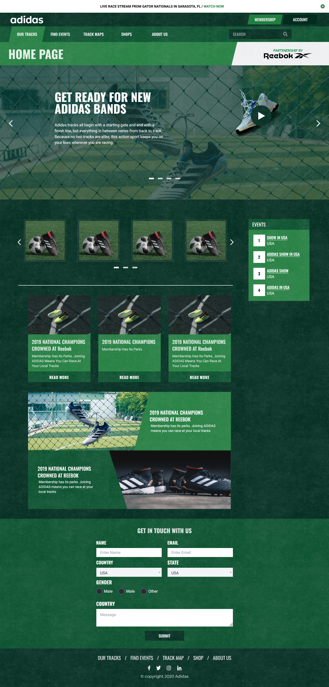
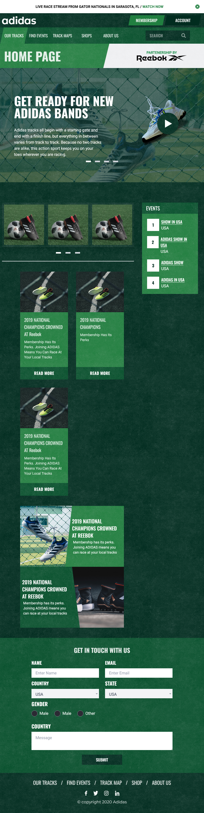
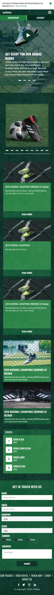

React SPA Skill Test Project

This is a simple Single Page Application (SPA) built with React 19, Vite, and TailwindCSS.
It demonstrates a component-based structure with responsive UI, a blog section, products, events, and a video popup.

 Project Structure
src/
 ├── Components/
 │   ├── BannerShowCase.jsx
 │   ├── Blog.jsx
 │   ├── CTA.jsx
 │   ├── Events.jsx
 │   ├── Footer.jsx
 │   ├── Headline.jsx
 │   ├── Header.jsx
 │   ├── Hero.jsx
 │   ├── Navigation.jsx
 │   ├── Products.jsx
 │   └── VideoPopup.jsx
 ├── App.jsx
 └── main.jsx

 Tech Stack

React 19 – Component-based UI

Vite 7 – Lightning-fast bundler

TailwindCSS 4 – Utility-first styling

React Slick – Carousel/slider

React Icons – Icons library

Installation

Clone the repository and install dependencies:
git clone `https://github.com/hammadmeer-dev/test`
cd test
npm install

Development
Start the local development server:
npm run dev
Build the project for production:
npm run build
Preview the production build:
npm run preview

Features

📌 Sticky navigation header

🎥 Custom video popup (React Portal)

📰 Blog & Events section

🛒 Products showcase

📱 Fully responsive (desktop, tablet, mobile)

🎨 Styled with TailwindCSS

## 📸 Screenshots
###  PC View

### Tablet View

### Mobile View

### Responsive Navigation

